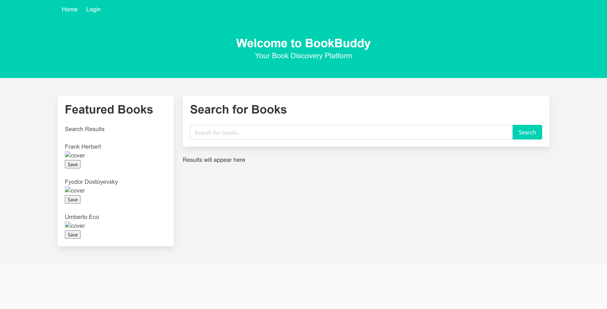

# BookBuddy - MVC App

Welcome to BookBuddy, your Book Discovery Platform!

BookBuddy is a web application that allows users to discover and manage their favorite books. This README provides an overview of the app's features and other relevant information.

## Features

BookBuddy offers the following features:

1. **Browse Books**: Users can browse a collection of books, view book details, and search for specific books.
2. **My Books**: Users can save and manage their favorite books. They can add, edit, and remove books from their collection.
3. **Book Details**: Users can view detailed information about each book, including the title, author, and description.
4. **User Authentication**: Secure user registration and login system to personalize the experience.
5. **Responsive Design**: The app is responsive and works on both desktop and mobile devices.

## License

This project is licensed under the [MIT License](LICENSE).

---

Thank you for using BookBuddy! We hope you enjoy discovering and managing your books.
